# Project #12: Excited Electronic States: CIS and TDHF/RPA

The simplest *ab initio* methods for describing excited electronic states are
based on Hartree-Fock theory, namely configuration interaction singles (CIS)
and time-dependent Hartree-Fock (TDHF), which is also known as the random-phase
approximation (RPA). The purpose of this project is to develop simple
implementations of these two methods and to understand the basic differences
between them.  This project assumes you have completed at least the
[CCSD programming project](../Project%2305).

You can read more about these methods in 
[J.B. Foresman, M. Head-Gordon, J.A. Pople, and M.J. Frisch, J. Phys. Chem. 96, 135-141 (1992)](http://pubs.acs.org/doi/pdf/10.1021/j100180a030) (CIS) 
and [P. Jørgensen and J. Simons, "Second-Quantization Based Methods in Quantum Chemistry", Academic Press, New York, 1981.](http://addison.vt.edu/record=b1305858~S1) (RPA)

## Configuration Interaction Singles (CIS)

The fundamental idea behind CIS is the representation of the excited-state wave
functions as linear combinations of singly excited determinants relative to the
Hartree-Fock reference wave function, *viz.*

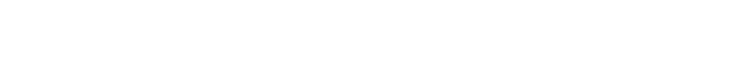

where *m* identifies the various excited states, and we will use *i* and *j*
(*a* and *b*) to denote occupied (unoccupied) spin-orbitals. Inserting this
into the Schr<html>&ouml;</html>dinger equation and left-projecting onto a
particular singly excited determinant gives

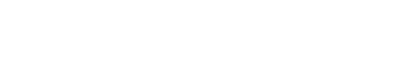

If we recognize that we have one of these equations for every combination of
*i* and *a* spin-orbitals, then this equation may be viewed as a matrix
eigenvalue problem:

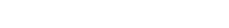

To solve this equation, we need an expression for the matrix elements in terms
of things we already know, i.e. Fock matrix elements and two-electron
integrals.  This can be done using either algebraic or diagrammatic techniques
to obtain (in the spin-orbital notation of previous projects):

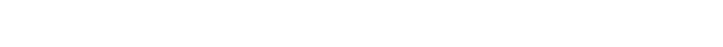

Our task is then relatively simple: Build the Hamiltonian matrix (expressed in
the basis of all singly excited determinants) using the above expression and
diagonalize it.  Note that the CIS Hamiltonian matrix is symmetric (check for
yourself by swapping *i/a* and *j/b*), with dimensions of the number of
occupied orbitals times the number of unoccupied orbitals.  For our
STO-3G/H2O test case, with its ten occupied and four unoccupied
spin-orbitals, the matrix will be 40 x 40.

  * [Hint](./hints/hint1.md): CIS Hamiltonian for STO-3G H2O

Make sure you can compute the correct CIS excitation energies for each of the
four test cases provided at the end of the page.  Before you move on to the
next section, can you explain the degeneracies appearing in the
excitation-energy list?

## Spin Adaptation of CIS

If you carefully examine the list of eigenvalues you computed above, you will
notice a pattern: some of the eigenvalues are unique (i.e., they occur only
once), while others appear in groups of three.  The former correspond to
spin-singlet excited states and the latter to spin-triplets, and all are
eigenfunctions of the S2 and Sz operators by virtue of
the fact that the spin-restricted Hartree-Fock reference wave function is such
an eigenfunction (by design, of course) and that the single-excitation
operators must yield identical amplitudes (to within a sign) for both
<html>&alpha;-</html> and <html>&beta;-</html>spin excitations.

Consider the structure of the singlet and triplet determinantal wave functions
from a simple two-electron/two-orbital example (such as the *1s 2s* excited
state configuration of the He atom).  One can easily show that the four
possible determinants arising from this configuration,

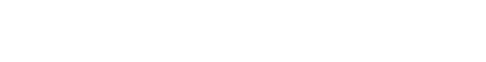

are components of one singlet and one triplet in the following combinations:

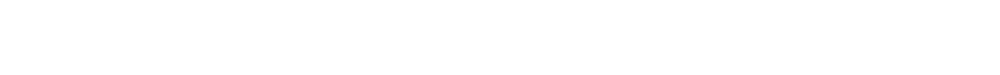

and

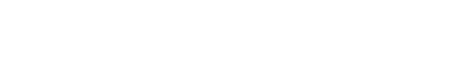

We can use this fact to reduce the dimension of our original CIS Hamiltonian by
re-writing it in a basis of spin-adapted functions.  In the case of the
spin-singlets, we use the function

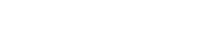

whereas, for the spin-triplet wave functions, we may use

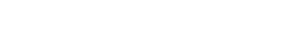

which is the MS = 0 component of the triplet.  In both cases, the
resulting CIS Hamiltonian has dimensions of the number of occupied spatial
orbitals times the number of unoccupied spatial orbitals -- one quarter the
size of the original spin-orbital CIS Hamiltonian.  Using the Slater-Condon
rules, one may derive the following matrix elements:

Singlets:

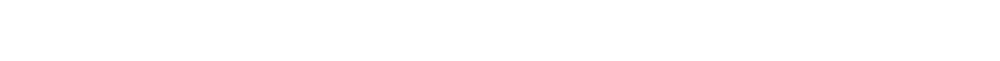

Triplets:

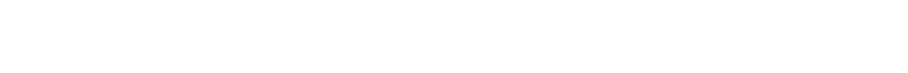

  * [Hint](./hints/hint2.md): Spin-Adapted CIS Hamiltonian for STO-3G H2O

Again, make sure you can compute the correct CIS excitation energies for each
of the four test cases provided at the end of the page.  What is the
relationship between the eigenvalues of the original CIS matrix and those of
the spin-adapted matrices?

## Time-Dependent Hartree-Fock / Random-Phase Approximation

One of the important limitations of CIS is that the ground state is described
by a single Hartree-Fock determinant.  Thus, the method lacks ground-state
correlation, which can lead to significant errors in excitation energies.  A
closely related method that partially corrects this deficiency is
Time-Dependent Hartree-Fock (TDHF), also called the random-phase approximation
(RPA).  The TDHF/RPA wave function may be written in terms of both excitation
and de-excitation operators, and the resulting eigenvalue equation is

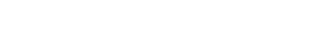

where the **A** and **B** matrices have elements

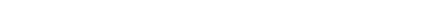

and

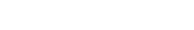

Thus, the row/column dimension of the TDHF/RPA Hamiltonian is twice that of the
CIS Hamiltonian, and the matrix is non-symmetric (so you must be careful about
the diagonalization function you choose).  Do you obtain twice as many
excitation energies?

  * [Hint](./hints/hint3.md): TDHF/RPA Hamiltonian for STO-3G H2O

## A Better Approach to Solving the TDHF/RPA Eigenvalue Equations

Instead of solving the full-dimensional TDHF/RPA equations, which, as noted
above, is twice the size of the CIS problem (and thus four times the
Hamiltonian storage cost), one can rearrange the eigenvalue equations.  First
write eigenvalue equation two separate equations, each in terms of the
submatrices **A** and **B**:

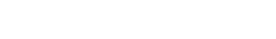

and

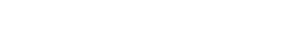

Now take +/- combinations of these equations to obtain

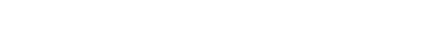

and

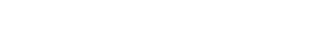

Solve for ***(X+Y)*** in the second equation:

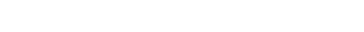

Insert this result into the first equation, rearrange a bit, and finally
obtain:

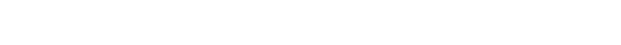

This is an eigenvalue equation of the same dimension as the CIS eigenvalue
equation (number of occupied orbitals times number of unoccupied orbitals),
where the eigenvalue is the square of the excitation energy and the eigenvector
is ***X-Y*** .

Make sure you can get the same set of excitation energies using the
full-dimensional TDHF/RPA approach above, as well as this reduced-dimension
approach, for all four test cases below.

## Test Cases
The input structures, integrals, etc. for these examples may be found in the 
[input directory](./input). Cartesian coordinates in the provided `geom.dat`
files are in **bohr**; convert them explicitly if an external program expects
angstroms.

| Test Case | CIS | RPA (Method 1) | RPA (Method 2) |
|-----------|-----|----------------|----------------|
| STO-3G Water | [output](./output/h2o/STO-3G/output_cis.txt) | [output](./output/h2o/STO-3G/output_rpa1.txt) | [output](./output/h2o/STO-3G/output_rpa2.txt) |
| DZ Water | [output](./output/h2o/DZ/output_cis.txt) | [output](./output/h2o/DZ/output_rpa1.txt) | [output](./output/h2o/DZ/output_rpa2.txt) |
| DZP Water | [output](./output/h2o/DZP/output_cis.txt) | [output](./output/h2o/DZP/output_rpa1.txt) | [output](./output/h2o/DZP/output_rpa2.txt) |
| STO-3G Methane | [output](./output/ch4/STO-3G/output_cis.txt) | [output](./output/ch4/STO-3G/output_rpa1.txt) | [output](./output/ch4/STO-3G/output_rpa2.txt) |
